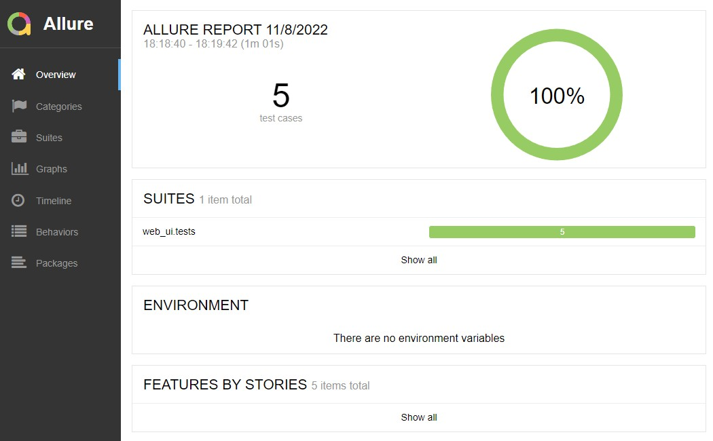
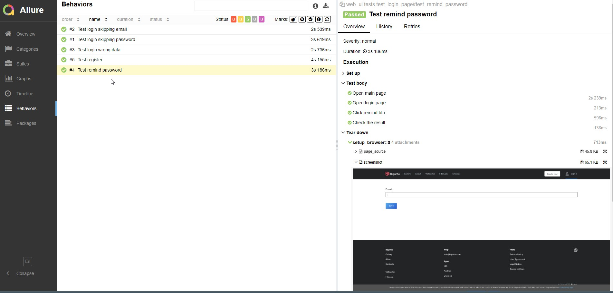

# Демо-проект автоматизации тестирования веб-сайта (UI&API)  и мобильного приложения
https://biganto.com/

# Используемые технологии

- Python
- Selene
- Selenoid
- Allure Report
- Jenkins
- Telegram Bot

# Описание
Тестирование авторизационной формы с использованием указанных технологий.

- Тесты запущены из CI системы Jenkins
- Для контейнеризации selenide тестов использован Selenoid
- Сгенерирован отчет Allure reports (автоматически добавлены скриншоты и видео прохождения тестов)
- Уведомление с отчетом о прохождении тестов отправлено в Telegram

## Отчеты Allure reports
### Общий отчет о прохождении тест-сьюта

### Детальный отчет о прохождении конкретного теста

### Видео прохождения теста

## Уведомление в Telegram

